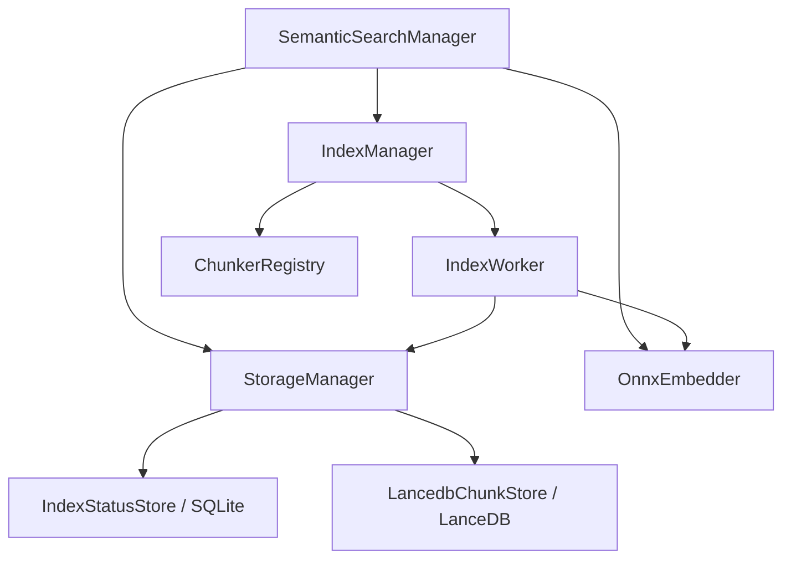

# vnext_semantic_search 设计说明

本文档基于当前代码库结构，描述语义检索库的**目标、分层架构、数据流与主要模块职责**，便于后续扩展与协作。

---

## 1. 项目目标

在本地或受控环境中，对代码仓库中的文本进行**分块 → 向量嵌入 → 持久化与检索**，支持按**索引层**（文件 / 符号 / 内容等）组织数据，并提供**增量索引**（基于文件元数据与内容哈希的差异）。

核心能力概括：

- **嵌入**：通过 ONNX Runtime 加载向量模型，批量推理。
- **关系元数据**：SQLite 记录项目、文件级索引状态。
- **向量检索**：LanceDB 存储 chunk 与向量，支持近邻搜索与路径过滤。
- **编排**：`SemanticSearchManager` 统一创建存储、嵌入器、索引管理器，并暴露建索引与查询入口。

---

## 2. 总体架构

逻辑上分为五层（自顶向下）：

| 层次 | 职责 | 主要入口 / 类型 |
|------|------|------------------|
| 应用编排 | 项目生命周期、对外 API | `SemanticSearchManager`（`src/manager.rs`） |
| 索引 | 扫描、差异、分块、调度 Worker | `IndexManager`、`IndexWorker`（`src/index/`） |
| 文档分块 | 按语言/层选择 Chunker | `ChunkerRegistry`、文件 Chunker、TS 符号 Chunker（`src/document_chunker/`） |
| 嵌入 | ONNX 推理与配置 | `OnnxEmbedder`（`src/embedding/onnx.rs`） |
| 存储 | SQLite + LanceDB 门面 | `StorageManager`（`src/storage/manager.rs`） |

依赖关系（简图）：

---

## 3. 核心领域模型

定义于 `src/common/data.rs`：

- **`Project`**：一次索引会话对应的逻辑项目（根路径、嵌入模型标识、完成时间等）。
- **`IndexType`**：索引层枚举，如 `File` / `Symbol` / `Content`，与表名、过滤条件、Chunker 选择相关。
- **`IndexStatus`**：某项目下某层、某相对路径文件的索引状态（哈希、mtime、ctime、大小等），用于**增量 diff**。
- **`Chunk` / `ChunkInfo`**：带 `ChunkInfo`（路径、语言、层、可选 LSP `Range`）与 `embedding` 向量，是写入向量库与检索回传的基本单元。
- **`QueryResult`**：检索得分与 `ChunkInfo`。

---

## 4. 存储设计

### 4.1 SQLite（`src/storage/rdb/`）

- **`schema.sql`**：项目表、按项目与层查询的 `index_status` 等（以仓库内实际 DDL 为准）。
- **`IndexStatusStore`**：封装连接、项目 CRUD、`index_status` 的查询与更新，供 `StorageManager` 调用。

### 4.2 LanceDB（`src/storage/vector_db/lancedb.rs`）

- 按 **`{layer}_{identifier}`** 等形式组织表名，与 `IndexType` 组合。
- Schema 包含：`id`、`layer`、`file_path`、`lang`、**`chunk_info`（JSON 序列化的 `ChunkInfo`，Utf8）**、**定长 `embedding` 向量**。
- 支持 `append_chunks`、`search`（余弦距离，可选 `file_path IN (...)` 过滤）、按路径删除等。

### 4.3 `StorageManager`

聚合 **RDB + 向量库** 的路径配置（`StorageOptions`），对上提供「项目 / 索引状态 / chunk 写入与检索」的统一接口，避免上层直接依赖两套存储细节。

---

## 5. 嵌入层（ONNX）

- **`OnnxEmbedder`**：加载动态库形式的 ONNX Runtime，按配置选择图优化级别（必要时可降级以避免部分 FP16 图优化与模型不兼容）。
- **`EmbeddingOptions` / `OnnxRuntimeConfig`**：维度、批大小、模型类型、线程等（见 `src/embedding/utils.rs`）。
- 批处理接口对 `IndexWorker` 暴露，便于与通道、背压配合。

---

## 6. 索引流水线

1. **扫描当前项目**：`FileChecker` + `FileService` + `ignore` 等工具构造「当前应索引文件集合」。
2. **加载历史状态**：从 SQLite 读取该层已有 `IndexStatus`。
3. **差异计算**：`calculate_diff` 得到新增、删除、更新集合。
4. **分块**：`ChunkerRegistry` 按 `IndexType` 与语言路由到具体 Chunker（如整文件、tree-sitter TS 符号）。
5. **嵌入与写入**：`IndexWorker` 内批嵌入、经 `StorageManager` 写入 LanceDB，并更新 SQLite 中的状态。
6. **进度与取消**：通过 `ProgressReporter`、`CancelToken`（`src/index/utils.rs`）与异步任务协作。
7. **指标**：`IndexProfiler`（`src/metrics/profiler.rs`）结合 `IndexMetrics`（`src/metrics/data.rs`）、阶段计时（`src/metrics/timer.rs`）汇总耗时、资源与存储占用。

默认可按层（如 File / Symbol）并行或分阶段调度，具体策略以 `SemanticSearchManager` / `IndexManager` 实现为准。

---

## 7. 公共与工具模块

- **`common`**：数据模型、文件访问、日志、路径与遍历工具（如 `construct_walker`、哈希、时间戳）。
- **`language`**：语言枚举与识别，供 Chunker 选择。
- **`metrics`**：除索引画像外，可包含通用 `MetricBatch` 等（见各子模块）。
- **`test`**：测试用临时目录、运行时路径等（`src/test/utils.rs`）。

---

## 8. 依赖与运行约束

- **异步运行时**：Tokio（多线程、fs、同步原语等）。
- **向量与表**：`arrow-array` / `arrow-schema` 与 LanceDB 版本需保持一致（见 `Cargo.toml`）。
- **ONNX**：依赖本机或打包的 ONNX Runtime 动态库；CI/测试环境需正确配置路径。
- **日志**：`log` + `log4rs`，便于在生产中落盘与分级。

---

## 9. 扩展建议

- **新语言 / 新层**：实现 `Chunker` trait 并在 `ChunkerRegistry` 注册；必要时扩展 `IndexType` 与 LanceDB 表命名约定。
- **新向量后端**：抽象 `Embedder` trait（已有雏形）并替换实现，保持 `Chunk` 结构稳定。
- **观测**：将 `IndexMetrics` 导出为 Prometheus / 文件，或接入统一 APM。

---

## 10. 文档与版本

- 本文档随仓库维护；若模块目录或公开 API 大幅变更，请同步更新本节与 `src/lib.rs` 导出说明。
- 构建与任务入口可参考仓库根目录 `Makefile.toml`（若使用 `cargo-make` 等工具）。
