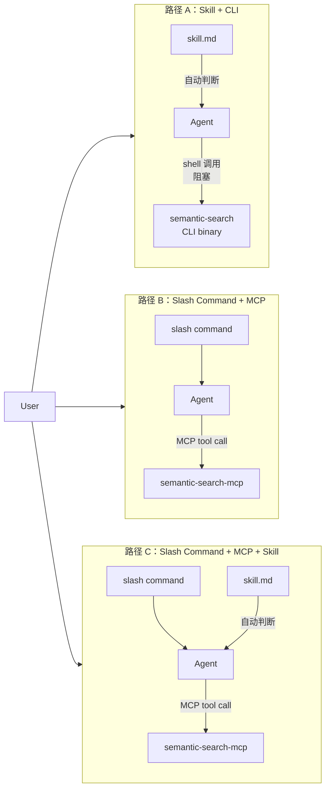

# OpenCode 集成语义搜索

本文档描述如何将语义搜索能力接入 **OpenCode**。提供三条集成路径

| | 路径 A：Skill + CLI | 路径 B：Slash Command + MCP | 路径 C：Slash Command + MCP + Skill |
|---|---|---|---|
| 部署复杂度 | 只需 `semantic-search` binary | 需启动 `semantic-search-mcp` server | 需启动 MCP server + 安装 skill |
| 索引方式 | 阻塞等待完成 | 后台非阻塞，可轮询进度 | 后台非阻塞，可轮询进度 |
| 索引期间能否 search | 否（agent 被阻塞） | 能（返回部分结果） | 能（返回部分结果） |
| 进度 / 取消 | 无 | slash command 显式控制 | slash command 显式控制 |
| Agent search 行为 | skill 驱动（调 binary） | 依赖模型自身判断 + MCP instructions | skill 提供更明确的指导，行为更稳定 |
| 额外上下文开销 | skill 文件 | 无 | skill 文件 |
| 适用场景 | 轻量集成，不想维护 MCP server | 信任模型自身判断，不需要额外指导 | 需要可靠一致的 search 行为 + 用户手动控制 |

---

## 总体架构



- **路径 A**：部署最简单，但索引阻塞，期间无法 search。
- **路径 B**：MCP 提供非阻塞索引与进度控制，agent 依赖模型自身能力和 MCP instructions 判断何时搜索。
- **路径 C**：在路径 B 基础上加 skill，为 agent 提供更明确的行为指导（layer 选择、何时不该搜索等），行为更稳定，但增加上下文开销。

---

## 路径 A：Skill

### 部署

确保 `semantic-search` binary 在 agent 可执行的 PATH 中

### 安装 Skill

将 `skill/skill.md` 复制到目标仓库的 `.opencode/` 目录：

```
.opencode/
└── skill.md
```

OpenCode 会自动将其加载为 agent 上下文。Skill 内容告知 agent：
- 何时执行 `semantic-search search`（代码定位类问题时自动触发）
- 首次使用或代码大幅变更后先执行 `semantic-search index --layer all`
- 两个命令均为阻塞式，agent 等待命令完成即可，无需轮询

### 路径 A 的弊端

| 弊端 | 说明 |
|------|------|
| **索引期间无法 search** | `index` 阻塞 agent 当前执行线程，索引未完成前无法响应任何搜索请求 |
| **无法获取部分结果** | MCP 路径下 `search` 可在索引进行中返回已写入的部分结果；CLI 路径下必须等索引全部完成 |
| **每次调用重新加载模型** | 每个 `semantic-search` 进程独立加载 ONNX Runtime 和嵌入模型（数百 MB），频繁 search 时开销显著 |
| **无进度反馈** | 大型仓库索引期间 agent 处于静默等待，无法向用户报告进度 |
| **并发访问风险** | 若同时触发两个进程操作同一仓库数据（如后台 index + 前台 search），存在 SQLite 锁竞争风险 |

---

## 路径 B：Slash Command + MCP Server

### 1. 配置 MCP Server

在 OpenCode 配置文件中注册 `semantic-search` MCP server：

```jsonc
{
  "mcpServers": {
    "semantic-search": {
      "command": ["/ABS/PATH/dist/semantic-search-mcp"],
    }
  }
}
```

**配置说明：**

| 配置项 | 说明 |
|--------|------|
| `command` | `semantic-search-mcp` 可执行文件的绝对路径 |

> **多仓库提示**：单个 MCP server 进程支持多仓库。OpenCode 在切换工作区时，只需在 tool 请求中传入 `project`（当前仓库根的绝对路径），无需为每个工程单独启动 server 进程。

---

### 2. Slash Command 参考

在目标仓库（被索引的 repo）中创建 `.opencode/commands/` 目录，并添加以下 Markdown 文件。文件名即命令名，frontmatter `description` 用于在 OpenCode 中展示命令说明，正文为 agent 执行该命令时的提示词模板。

> 参考：[OpenCode 自定义命令文档](https://opencode.ai/docs/zh-cn/commands/)

本仓库 `slash_commands/` 目录提供了可直接复制使用的模板文件。

### `/index`

**功能**：在后台触发语义索引更新（非阻塞，立即返回）。

**对应 MCP tool**：`index`，参数 `layer=all`。

**何时使用**：

- 首次进入仓库，尚未建立索引
- 仓库代码发生大规模变更后
- 需要手动强制刷新索引时

---

### `/index_progress`

**功能**：查询当前索引任务的进度与状态。

**对应 MCP tool**：`index_progress`。

**输出内容**：

- `status`：`running` / `done` / `cancelled` / `error` / `idle`
- 进度：已处理 / 总计（文件数、符号数）
- 错误信息（若有）及处理建议

---

### `/stop_index`

**功能**：取消/停止当前正在运行的索引任务。

**对应 MCP tool**：`stop_index`。

---

### `/index_last_update_time`

**功能**：查询当前工程上次索引完成的时间，以及索引是否已超过过期阈值（10 分钟）。

**对应 MCP tool**：`index_last_update_time`。

**输出内容**：
- 若从未完成索引：提示建议执行 `/index`
- 若已有完成记录：展示完成时间（epoch + 人类可读格式）、距今时长、是否已过期（`stale` 字段）

---

## 路径 C：Slash Command + MCP Server + Skill

路径 C 在路径 B 的基础上加入 skill。**没有 skill，路径 B 的 agent 也可以调用 `search`**——MCP tool schema 和 `instructions` 字段已经提供了基本指导，有能力的模型会自行判断何时搜索。

Skill 解决的不是"能不能搜"，而是**行为一致性**：

- **不加 skill**：agent 的搜索决策取决于模型能力和问题措辞，同一类问题可能触发也可能不触发
- **加 skill**：明确告知 layer 如何选、哪些场景不该用语义搜索（应用 rg/grep），减少不必要的 tool 调用

三者职责：
- **Slash command**：用户手动控制索引生命周期（`/index`、`/index_progress`、`/stop_index`、`/index_last_update_time`）
- **MCP server**：后台非阻塞索引 + 并发 search，执行层与路径 B 完全相同
- **Skill**：补充 agent 行为指导，提升 search 决策的稳定性与质量

### 安装 Skill

```
.opencode/
├── skill.md                  ← agent 自动搜索行为准则（调用 MCP tools）
```

> 注意：路径 C 的 skill 与路径 A 的 skill 内容不同——路径 A 的 skill 调 CLI binary，路径 C 的 skill 调 MCP tools。

### 路径 C 的 Skill 与 Slash Command 职责划分

| 触发方式 | 处理方 | 说明 |
|----------|--------|------|
| 用户问"X 在哪里/怎么实现" | **Skill** 驱动 agent 自动调 MCP `search` | 无需用户显式输入命令 |
| 用户输入 `/index` | **Slash command** 驱动 agent 调 `start_index` | 手动触发，立即返回 running |
| 用户输入 `/index_progress` | **Slash command** 驱动 agent 调 `index_progress` | 查看进度 |
| 用户输入 `/stop_index` | **Slash command** 驱动 agent 调 `stop_index` | 取消索引 |
| 用户输入 `/index_last_update_time` | **Slash command** 驱动 agent 调 `index_last_update_time` | 查看更新时间 |

### Agent 行为准则

**何时主动调用 MCP `search`：**

- **定位类**："X 在哪里实现/定义？""某接口/函数/struct 在哪个文件里？"
- **关系类**："谁调用了 X？""X 会触发哪些逻辑？"
- **意图类（不知道精确关键词）**："权限校验在哪里做的？""错误处理逻辑怎么运作？"
- **跨文件/跨模块**：需要从多个位置快速收敛候选范围

**不适合用语义搜索：**

- 查找字符串字面量的出现位置 → 用 `rg` / grep
- 纯概念解释、不依赖代码细节的问题

**`search` 默认参数：**

| 参数 | 默认值 | layer 选择建议 |
|------|--------|--------------|
| `layer` | `symbol` | 定义/调用关系用 `symbol`；找文件用 `file`；读文档/注释用 `content` |
| `limit` | `10` | 精准定位可降至 5 |
| `threshold` | `0.5` | 建议范围 0.4 ~ 0.8 |

**索引与搜索协同：**

- 执行 `search` 前无需强制等待索引完成，`search` 支持在索引进行中返回部分结果（需告知用户）
- `search` 内部在上次索引完成超过 10 分钟时会自动触发后台刷新

## 注意事项

| 事项 | 说明 |
|------|------|
| 索引是耗时任务 | `/index` 非阻塞，引导用户用 `/index_progress` 轮询；大型仓库首次索引可能需要数分钟 |
| 搜索可在索引中进行 | 结果仅包含已写入的部分，agent 需在回答中注明 |
| 取消是 best-effort | `stop_index` 触发 cancel token，具体停止点取决于 worker 检查频率 |
| 同一工程重复触发 | 索引 Running 中再次调用 `index` 会返回错误，agent 应提示用户等待或先 `/stop_index` |
| 多工程并行 | 不同工程可并行索引；同一工程避免多 server 实例共享同一数据目录，否则 SQLite / LanceDB 存在并发写入风险 |

---

## 交付物清单

### commands

将以下模板文件复制到目标仓库的 `.opencode/commands/` 目录：

```
.opencode/commands/
├── index.md
├── stop_index.md
├── index_progress.md
└── index_last_update_time.md
```

模板文件位于本仓库 `slash_commands/` 目录，可直接复制使用。

### skill

将 skill 文件放入目标仓库的 `.opencode/` 目录，OpenCode 会自动加载作为 agent 上下文：

```
.opencode/
└── skill.md       ← 从本仓库 skill/skill.md 复制
```

### mcp

将以下产物目录部署到目标机器，并在 OpenCode MCP 配置中指向对应路径：

```
semantic-search-mcp/
├── semantic-search-mcp            # 可执行文件（MCP server binary）
└── resources/
    ├── embedding/
    │   ├── veso/
    │   │   ├── model.onnx         # 默认嵌入模型（维度 768）
    │   │   └── tokenizer.json
    └── onnxruntime/
        ├── darwin-aarch64/
        │   └── onnxruntime.dylib
        ├── darwin-x86_64/
        │   └── onnxruntime.dylib
        └── windows-x86_64/
            └── onnxruntime.dll
```

在 OpenCode 配置中指向该目录：

```jsonc
{
  "mcpServers": {
    "semantic-search": {
      "command": ["/ABS/PATH/semantic-search-mcp/semantic-search-mcp"],
      }
    }
  }
}
```

