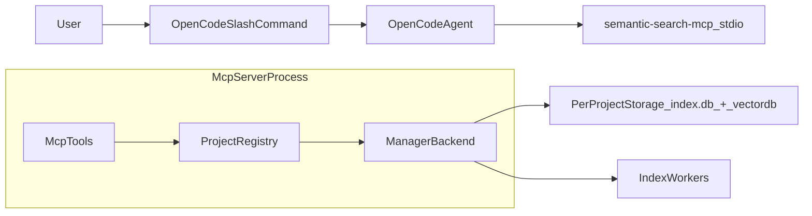

# OpenCode 接入语义搜索（Semantic Search）整体设计

本文档描述如何把本仓库的**语义索引/语义搜索**能力通过 **MCP（stdio）**接入 **OpenCode**，并在 OpenCode 内提供一组可复用的 **slash command** 与 **semantic search skill**（上层 agent 的调用准则）。

> 适用范围
> - OpenCode：通过自定义命令（slash command）驱动 agent 调用 MCP tools（命令本身是“提示词模板”）
> - MCP server：本仓库 `semantic-search-mcp`（stdio）已提供基础 tools，本设计补充更新时间查询与 search 前自动刷新策略

相关参考：
- OpenCode 自定义命令（slash command）：[命令 | OpenCode](https://opencode.ai/docs/zh-cn/commands/)
- 本仓库 MCP/CLI 说明：`docs/INTEGRATIONS.md`
- 本仓库现有 skill 草案：`docs/SKILL_SEMANTIC_SEARCH.md`

---

## 1. 目标与用户体验

### 1.1 用户可用的 OpenCode slash command

用户在 OpenCode 中应当获得以下 4 个命令：

- **`/index`**：主动触发索引更新（后台非阻塞）
- **`/stop_index`**：停止/取消当前索引
- **`/index_progress`**：查询当前索引进度与状态
- **`/index_last_update_time`**：获取上次索引完成时间（上次更新时间）

> 说明
> - 这里的 `/index` 在 MCP 层对应 `start_index(layer=all)`（file + symbol）。
> - **search** 能力不作为 slash command 强制暴露：OpenCode 的 agent 在回答“定位/实现/调用关系”等问题时**自动调用 MCP `search`**即可（同时也允许你额外提供 `/search` 命令，但不在本需求的必选项中）。

### 1.2 Search 自动刷新索引策略（核心需求）

MCP 中 `search` 工具在每次执行时遵循以下策略：

1. **读取上次索引完成时间** `index_finished_time`
2. 若距当前时间间隔 **超过 10 分钟（600s）**，则**触发后台索引更新**（等价 `start_index(layer=all)`），随后继续执行搜索
3. 返回搜索结果时**明确告知**：
   - 是否触发了 refresh（`index_refresh_triggered`）
   - 由于索引可能仍在进行中，本次搜索结果可能是**partial（不完整）**

该策略实现后，用户/agent 在日常使用时不必频繁手动 `/index`，但在仓库变更较大或首次使用时仍建议显式索引。

---

## 2. 总体架构



- **OpenCode slash command**：仅提供“可重复操作”的入口；命令是提示词模板，真正的动作由 agent 执行（调用 MCP tools）。
- **MCP server（stdio）**：承载索引与搜索的协议层；对外提供 tools，内部维护多工程 registry 与索引会话状态。
- **存储**：每工程一套 `index.db`（SQLite 元数据）+ `vectordb/`（LanceDB 向量表）；上次索引完成时间存放在 `index.db` 的 `projects.index_finished_time`。

---

## 3. OpenCode 侧详细设计

### 3.1 MCP server 配置（推荐）

OpenCode 支持 MCP server（stdio）配置。建议注册一个 server 名称：`semantic-search`。

配置要点：
- **command**：`semantic-search-mcp` 可执行文件的绝对路径（或在 PATH 中可直接执行）
- **env**：
  - **`SEMANTIC_SEARCH_PROJECT`**：默认工程根（当 tool 请求未显式传 `project` 时回退）
  - **`SEMANTIC_SEARCH_RESOURCES_DIR`**：可选，指向打包后的 `resources/`
  - **`SEMANTIC_SEARCH_MODEL_TYPE`**：可选，例如 `veso`
  - **`SEMANTIC_SEARCH_OUTPUT=json`**：建议（当前 MCP 返回 JSON 文本 payload）

示例（示意，按你的 OpenCode 配置文件结构落地）：

```jsonc
{
  "mcpServers": {
    "semantic-search": {
      "command": ["/ABS/PATH/dist/semantic-search-mcp"],
      "env": {
        "SEMANTIC_SEARCH_PROJECT": "/ABS/PATH/to/repo",
        "SEMANTIC_SEARCH_RESOURCES_DIR": "/ABS/PATH/dist/resources",
        "SEMANTIC_SEARCH_MODEL_TYPE": "veso",
        "SEMANTIC_SEARCH_OUTPUT": "json"
      }
    }
  }
}
```

> 多工程提示\n+> - 本仓库 MCP 已支持 tool 入参带 `project`（绝对路径）。OpenCode 若会切换工作目录/仓库，建议上层 agent 在调用 tool 时显式传入当前仓库根路径。\n+

### 3.2 Slash command 的落地方式（commands/ 目录）

OpenCode 支持在项目级目录 `.opencode/commands/` 下用 Markdown 文件定义命令（文件名即命令名），frontmatter 提供描述等元信息，正文为模板（参考 [命令 | OpenCode](https://opencode.ai/docs/zh-cn/commands/)）。

本设计建议你在目标工程仓库（被索引的那个 repo）中新增以下文件：

- `.opencode/commands/index.md`
- `.opencode/commands/stop_index.md`
- `.opencode/commands/index_progress.md`
- `.opencode/commands/index_last_update_time.md`

#### 3.2.1 `/index`（触发索引）

`.opencode/commands/index.md`（模板示例）：

```md
---
description: 触发语义索引更新（后台）
---

你需要调用 MCP server `semantic-search` 的 tool：`start_index`。

- 参数：
  - layer: "all"
  - project: 如果当前工作区可以确定仓库根路径，则传入该绝对路径；否则省略（由 SEMANTIC_SEARCH_PROJECT 兜底）

将 tool 返回的 JSON 用人类可读方式总结给用户：
- 当前状态（running/completed/error...）
- 本次索引 layers
- 下一步提示：建议用户用 /index_progress 轮询进度
```

#### 3.2.2 `/stop_index`（停止索引）

`.opencode/commands/stop_index.md`（模板示例）：

```md
---
description: 停止/取消语义索引
---

调用 MCP server `semantic-search` 的 tool：`stop_index`。

- 参数：
  - project: 同 /index 的规则

输出：将返回的状态总结给用户，并提示可重新 /index。
```

#### 3.2.3 `/index_progress`（索引进度）

`.opencode/commands/index_progress.md`（模板示例）：

```md
---
description: 查看语义索引进度
---

调用 MCP server `semantic-search` 的 tool：`index_progress`。

- 参数：
  - project: 同 /index 的规则

输出：把结果总结为：
- status
- handled/total（files、symbols）
- last_error（如果有）
并给出建议：
- running -> 继续轮询
- completed -> 可以开始 search（或继续使用）
- error -> 建议重新 /index
```

#### 3.2.4 `/index_last_update_time`（上次更新时间）

该命令依赖 MCP 新增 tool（见第 4 节）。\n+
`.opencode/commands/index_last_update_time.md`（模板示例）：

```md
---
description: 查看上次语义索引完成时间
---

调用 MCP server `semantic-search` 的 tool：`index_last_update_time`。

- 参数：
  - project: 同 /index 的规则

输出要求：
- 如果 index_finished_time 为空：提示“当前工程尚未完成过索引”，建议 /index
- 如果不为空：展示
  - 原始 epoch seconds
  - 人类可读时间（本地或 UTC）
  - 距今多久
  - 是否已超过 10min（如果 MCP 返回 stale 字段则直接使用）
```

---

## 4. MCP 侧详细设计

### 4.1 MCP tools 总览（对外契约）

当前已存在的 tools（`semantic-search-mcp`）：
- **`start_index`**：启动后台索引（非阻塞）
- **`index_progress`**：查询索引状态与进度
- **`stop_index`**：取消索引
- **`search`**：语义搜索

本设计新增 1 个 tool：
- **`index_last_update_time`**：读取 per-project `index_finished_time`（上次索引完成时间）

#### 4.1.1 参数约定：`project`

所有 tools 都应支持可选参数：
- `project?: string`：**工程根目录的绝对路径**

当 `project` 省略时，server 回退使用环境变量：
- `SEMANTIC_SEARCH_PROJECT`

> 重要：为了多工程稳定性\n+> - MCP 内部会对 `project` 做规范化（canonicalize/normalize），并映射到 per-project backend。\n+

### 4.2 新增 tool：`index_last_update_time`

#### 4.2.1 输入（JSON）

```json
{
  "project": "/abs/path/to/repo" // optional
}
```

#### 4.2.2 输出（JSON 文本 payload）

建议返回结构（字段名可按 Rust serde 风格 snake_case）：

```json
{
  "project": "<project_key>",
  "index_finished_time": 1712640000,
  "now": 1712640300,
  "stale_threshold_seconds": 600,
  "stale": false,
  "usage_hint": "..."
}
```

语义：
- `index_finished_time`：`null` 表示该工程从未完成过索引（首次使用或索引失败/未跑完）
- `stale`：当 `index_finished_time` 为 null 时可返回 `true/false`（建议 `true`，表示“需要索引”），或返回 `null`（三态）；本设计推荐：\n+  - `index_finished_time == null` => `stale = true`\n+

#### 4.2.3 数据源与一致性

数据源来自本工程 `index.db`（SQLite）中的 `projects.index_finished_time`：\n+索引完成后写入，读取时直接取 `projects LIMIT 1`。\n+

### 4.3 `search` tool：10min 自动刷新索引（实现策略）

`search(query, ...)` 在执行搜索前增加 staleness 检查：

#### 4.3.1 判定逻辑

- 读取 `index_finished_time`：\n+  - `None/null`：表示未完成过索引\n+  - `Some(t)`：上次索引完成时间（epoch seconds）\n+
- 计算 `delta = now - t`（秒）\n+- 当 `delta > 600` 时触发 refresh

#### 4.3.2 触发方式（非阻塞）

触发 refresh 等价于调用 `start_index(layer=all)`：\n+- 不等待索引完成\n+- 继续执行本次搜索（结果可能是旧索引/部分更新）\n+

#### 4.3.3 幂等与并发

为了避免重复触发，`search` 在触发前应满足以下任一策略：\n+- **策略 A（推荐）**：先读 `index_progress`/session 状态，如果 `Running` 则不触发；否则触发\n+- **策略 B**：直接尝试 `start_index`，若返回“already running”则吞掉该错误并继续 search\n+

#### 4.3.4 返回字段建议（增强可观测性）

为让上层 agent 解释清楚“为什么结果可能不完整”，建议 `search` response 增加：\n+- `index_refresh_triggered: bool`\n+- `index_last_update_time: Option<u64>`\n+- `index_status_at_search: \"not_started\"|\"running\"|\"completed\"|...`\n+- `note: string`（例如：索引仍在更新，本次结果可能基于旧索引）\n+

> 兼容性\n+> - 当前 `search` 已返回 `usage_hint` 与 `results`；新增字段不破坏 JSON 解析（向后兼容），OpenCode 侧模板可逐步消费。\n+

---

## 5. Semantic Search Skill（面向 agent 的调用准则）

本节定义一个可复用的“skill”（实际上是给上层 agent 的操作手册），用于规范：\n+**什么时候该用语义搜索、怎么调用、索引与搜索如何协同、OpenCode slash command 如何映射到 MCP tools**。\n+

### 5.1 什么时候应该调用 MCP `search`

满足以下任一条件时，优先使用语义搜索：\n+- **定位类**：\n+  - “X 在哪里实现/定义？”\n+  - “某接口/struct/函数在哪？”\n+- **关系类**：\n+  - “谁调用了 X？”“X 会触发哪些逻辑？”\n+  - “这段逻辑和哪些模块相关？”\n+- **意图类（不知道关键词）**：\n+  - “权限校验在哪里做？”“索引进度怎么更新？”\n+- **跨文件/跨模块**：\n+  - 需要从多个文件中快速收敛候选范围\n+
不建议用语义搜索的情况：\n+- **纯字符串出现位置**（比如“这个字符串在哪出现”）：更适合关键词搜索（rg/grep）\n+- **纯概念解释**且不依赖代码细节\n+

### 5.2 `search` 的默认参数建议

默认值（除非用户场景明显需要调整）：\n+- `layer = symbol`（定位定义/调用关系更稳定）\n+- `limit = 10`\n+- `threshold = 0.5`\n+- `paths = []`（当用户限定目录/模块时再加过滤）\n+
层选择建议：\n+- **symbol**：定位“定义/调用/接口实现”等（默认）\n+- **content**：当用户要“读文档/注释/README/协议文本”\n+- **file**：更粗粒度，适合找“哪个文件最相关”\n+- **all**：需要更全面候选集时（成本更高）\n+

### 5.3 索引策略与用户引导

- 用户显式请求：\n+  - `/index` => 立刻触发 `start_index(layer=all)`\n+  - `/index_progress` => `index_progress`\n+  - `/stop_index` => `stop_index`\n+  - `/index_last_update_time` => `index_last_update_time`\n+- agent 主动行为：\n+  - 在执行 `search` 前无需强制等待索引完成\n+  - `search` 内部会在索引过旧（>10min）时自动触发 refresh，因此 agent 不必每次都先 `/index`\n+  - 若索引正在进行中，回答中需提示：**结果可能不完整**\n+

### 5.4 OpenCode 中的最小行为准则（建议写入系统提示/skill 文档）

可以直接使用以下简化规则：\n+
```text
当用户在问“代码在哪里/怎么实现/谁调用谁/相关模块有哪些”，优先调用 semantic-search MCP 的 search。
search 会在索引超过 10min 时自动触发后台刷新；若索引正在进行中，结果可能不完整，需要在回答里说明。
当用户显式输入 /index、/index_progress、/stop_index、/index_last_update_time 时，分别调用对应 MCP tool。
```

---

## 6. 交付物清单（落地到仓库/工程）

### 6.1 OpenCode（目标工程仓库内）

- `.opencode/commands/index.md`\n+- `.opencode/commands/stop_index.md`\n+- `.opencode/commands/index_progress.md`\n+- `.opencode/commands/index_last_update_time.md`\n+

### 6.2 语义搜索仓库（本仓库）

- MCP 增加 tool：`index_last_update_time`\n+- MCP `search` 增加 10min staleness 检查与后台 refresh\n+- Skill 文档：\n+  - 方案 A：更新 `docs/SKILL_SEMANTIC_SEARCH.md`（增加 OpenCode 章节 + 新命令）\n+  - 方案 B：新增 `docs/SKILL_SEMANTIC_SEARCH_OPENCODE.md`（更聚焦，避免影响现有读者）\n+

---

## 7. 验收标准（建议）

在 OpenCode 中：\n+- `/index` 能触发后台索引（返回 running）\n+- `/index_progress` 能观察到 handled/total 逐步变化并最终 completed\n+- `/stop_index` 能把状态切到 cancelled（best-effort）\n+- `/index_last_update_time` 能显示 epoch 时间与“距今多久”\n+- 在 `index_finished_time` 超过 10min 后，随便问一个“代码在哪里”的问题：agent 调用 `search` 时 MCP 能自动触发 refresh 且搜索仍返回结果，并提示可能 partial\n+
