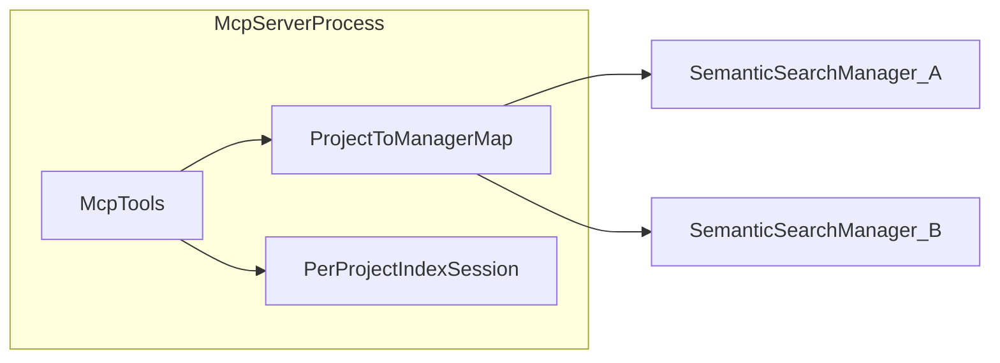

## 目标

把本项目的语义索引/搜索能力，通过 MCP（stdio）包装成一个**可复用的“skill”**，让其他 agent（OpenCode / Cursor / Claude Code 等）在合适时机自动调用。

skill 需要支持的用户指令（slash commands）：

- `/start_index`：对“当前工程”启动索引；可选参数为工程路径（见“多工程”）
- `/index_progress`：查看索引进度/状态；可选工程路径（见“多工程”）
- `/stop_index`：停止/取消当前索引；可选工程路径（见“多工程”）

并且需要指导 agent：

- 什么时候应该用语义搜索（MCP `search` 工具）来辅助回答问题

---

## MCP 工具契约（server 暴露的 tools）

本仓库的 MCP server（`semantic-search-mcp`）通过 stdio 暴露以下 tools（JSON 入参/JSON 文本出参）：

- **`start_index`**：后台启动索引（非阻塞）
- **`index_progress`**：查询索引状态与进度
- **`stop_index`**：取消索引
- **`search`**：语义搜索

### 实现状态（当前仓库）

`semantic-search-mcp` 已在进程内维护 **`project_path_key` → `ManagerBackend`（含 `SemanticSearchManager` + 索引会话）** 的惰性注册表。各 tool 支持可选 **`project`**（绝对路径）；省略时回退到环境变量 **`SEMANTIC_SEARCH_PROJECT`**（进程级默认工程根）。**存储路径**按「规范化工程根」计算：基础路径来自 `platform_project_default_paths`；当某工程的键与 `SEMANTIC_SEARCH_PROJECT` 指向的工程键一致时，可用 `SEMANTIC_SEARCH_INDEX_DB` / `SEMANTIC_SEARCH_VECTOR_DB` 覆盖对应 SQLite / LanceDB 路径；**其它工程**仅使用平台数据目录下按工程隔离的默认路径，避免全局 db 环境变量误伤多工程场景。MCP 进程启动时不再通过 CLI 传入 `project` / `index_db_path` / `vector_db_path` / `log_path`，这些全部通过环境变量配置。同一工程在 `Running` 时再次 `start_index` 会返回错误。下文 **「目标设计」** 仍描述架构边界与 agent 约定，与实现对齐处不再标注「尚未实现」。

### 约定：默认工程与路径 → Manager 映射（目标设计）

- **默认工程**：`SEMANTIC_SEARCH_PROJECT` 在 agent **未**在 tool 中传入 `project` 时作为 **fallback**（进程级「当前默认仓」）。
- **按路径路由**：`start_index`、`index_progress`、`stop_index`、`search` 等 tool 支持可选参数 **`project`**（工程根目录的 **绝对路径** 字符串）。Server 根据该路径在进程内 **选择或惰性创建** 对应的 `SemanticSearchManager`（每个工程一套 `StorageOptions`，继续沿用按工程隔离的默认 `index_db_path` / `vector_db_path`，见仓库内 `project_default_paths` / `project_storage_dir_name`）。
- **映射键（逻辑工程键）**：与数据目录派生规则一致，应对工程根做 **`canonicalize`（或等价规范化）** 后的字符串作为 `HashMap` 键，避免 `./repo` 与 `/abs/repo` 被当成两个工程、创建两套 Manager 与重复数据目录。
- **索引会话**：`start_index` / `index_progress` / `stop_index` 的 running、progress、cancel token 等状态必须 **按上述逻辑工程键隔离**（例如 `HashMap<PathKey, IndexSession>`），不能与单个全局 Manager 绑死。

---

## OpenCode 配置 MCP（stdio）

OpenCode 的 MCP 配置中 `command` 是数组（第一个元素为可执行文件路径）。

下面是推荐配置（把路径替换成你的 dist 产物目录）：

```json
{
  "mcpServers": {
    "semantic-search": {
      "command": ["/ABS/PATH/dist/semantic-search-mcp"],
      "env": {
        "SEMANTIC_SEARCH_PROJECT": "/ABS/PATH/to/your/project",
        "SEMANTIC_SEARCH_RESOURCES_DIR": "/ABS/PATH/dist/resources",
        "SEMANTIC_SEARCH_MODEL_TYPE": "veso",
        "SEMANTIC_SEARCH_OUTPUT": "json"
      }
    }
  }
}
```

说明：`SEMANTIC_SEARCH_PROJECT` 作为 **默认工程**；OpenCode 等可切换工作目录时，换目录后通过各 tool 的 **`project`** 指向当前仓库根即可（**无需**为每个工程单独起 MCP 进程）。

可选（显式指定数据文件；不设时由 **当次解析的工程根**（默认即 `SEMANTIC_SEARCH_PROJECT`）推导 **按工程隔离** 的默认路径：`${DATA_DIR}/semantic_search/{安全化目录名}_{路径哈希}/` 下的 `index.db`、`vectordb/`、`running.log`。旧版全局 `${DATA_DIR}/semantic_search/index.db` 不会自动迁移，升级后需重新索引）：

- `SEMANTIC_SEARCH_INDEX_DB`
- `SEMANTIC_SEARCH_VECTOR_DB`
- `SEMANTIC_SEARCH_LOG_PATH`

---

## Skill 行为设计（给 agent 的“操作手册”）

这一节给“上层 agent”一个可直接照抄的策略：如何把用户 slash command 翻译成 MCP tool 调用。当前实现下，后台索引统一通过 **`start_index`** 完成，并支持可选 **`project`**（省略则用环境变量 `SEMANTIC_SEARCH_PROJECT` 作为默认工程）。

### /start_index

**触发条件**：
- 用户显式输入 `/start_index`

**执行**：
- 调用 MCP tool：`start_index`
- 参数：
  - `layer`：缺省用 `all`（file+symbol）
  - `project`（目标设计）：用户带了工程路径或需对齐当前工作区时，传入该仓库根的 **规范化绝对路径**；省略则用环境变量/会话默认工程

**返回**：
- 将 `StartIndexResponse.status` 与 `layers` 反馈给用户
- 提示用户可用 `/index_progress` 轮询

### /index_progress

**触发条件**：
- 用户显式输入 `/index_progress`

**执行**：
- 调用 MCP tool：`index_progress`
- 参数：
  - `project`（目标设计）：与 `/start_index` 针对的 **同一** 工程键一致；省略则默认工程

**返回**：
- 展示：
  - `status`（running/completed/cancelled/error/not_started）
  - `progress.handled_* / progress.total_*`
  - 若 `last_error` 不为空，提示用户可以重试 `/start_index`

### /stop_index

**触发条件**：
- 用户显式输入 `/stop_index`

**执行**：
- 调用 MCP tool：`stop_index`
- 参数：
  - `project`（目标设计）：要停止索引的工程根路径；省略则默认工程

**返回**：
- 展示 `status`（一般为 cancelled）
- 告知用户可重新 `/start_index`

---

## 什么时候该使用语义搜索（给 agent 的决策规则）

当用户问题满足以下任一条件时，agent 应优先调用 MCP `search`：

- **定位类**：问“在哪里定义/实现/调用”  
  例：某函数/trait/struct 在哪；某配置在哪生效；某报错从哪抛出
- **关系类**：问“谁调用了谁 / 谁依赖了谁 / 哪些地方会触发”  
  例：某事件处理链路；某字段写入点
- **意图类（非精确字符串）**：用户描述功能但不知道关键字  
  例：“权限校验在哪里做的”“索引进度怎么更新的”
- **跨文件/跨模块**：需要从多个层（symbol/file/content/all）合并理解

不适合用语义搜索的情况：

- 用户只问“某字符串是否存在/在哪里出现”：更适合关键词搜索（如 ripgrep）
- 纯概念/纯解释且不依赖代码细节的问题

### search 的参数建议

- 默认层：`symbol`（定位定义/调用最稳）
- 若问“读我项目里的文档/README/注释”：用 `content`
- 若想“尽量全”：用 `all`（会合并 file+symbol，返回结果按 score 排序截断）
- `project`（目标设计）：搜索哪套索引就传哪套工程根路径（与索引时一致）；OpenCode 等场景下建议每次用 **当前 shell 工作区对应的仓库根**（规范化绝对路径），勿假设仅启动时配置的固定目录

### OpenCode / 可变工作目录下的 agent 策略

- 在调用任意语义索引/搜索 tool 前，将 **当前工作目录所属的仓库根**（或用户 slash 中显式给出的路径）解析为绝对路径，作为 `project` 传入（目标实现落地后生效）。
- 若无法解析仓库根，可退化为 `SEMANTIC_SEARCH_PROJECT` 或与用户确认路径。

---

## 多工程：单 MCP 进程内的 registry（目标设计）

面向 OpenCode、Claude Code 等 **无固定「打开工程」、工作目录可切换** 的产品，推荐 **单个 `semantic-search-mcp` 进程** + 进程内注册表，而不是强制「一工程一 server」。

### Registry 职责

- **`ProjectToManagerMap`**：例如 `HashMap<PathKey, Arc<SemanticSearchManager>>`（或 `DashMap` 等并发 map）。对某逻辑工程键 **惰性** `get_or_insert`：首次访问时 `SemanticSearchManager::new` + 按该根路径计算 `StorageOptions`（默认仍使用按工程隔离的 `index.db` / `vectordb` 目录布局）。
- **`PerProjectIndexSession`**：例如 `HashMap<PathKey, IndexSession>`，承载 `start_index` / `index_progress` / `stop_index` 的状态机与 cancel token；键与 `ProjectToManagerMap` 一致。
- **嵌入资源**：ONNX / tokenizer 等仍可进程级共享；注意多工程并行索引时的 **内存与算力**（多份并发 `index` 任务）。

### 并发与存储

- **同一工程**：同时触发多次 `start_index` 时应 **串行化、幂等或明确拒绝**，避免同一 `index.db` / Lance 表上并发写冲突。
- **不同工程**：可并行索引（受机器资源限制）；每个工程数据目录独立，与现有「每工程一套 SQLite + Lance」模型一致。
- **显式共享路径**：若通过环境变量把多个逻辑工程指到同一 `index_db_path`，属于人为共享，需自行承担 SQLite/Lance 锁与并发写风险。



### 与「多进程多 server」的关系

仍允许为 **完全隔离** 或 **不同资源配额** 部署多个 MCP server 实例（每实例各自默认 `SEMANTIC_SEARCH_PROJECT`）；与单进程 registry 是互补部署方式，而非互斥。

---

## 资源文件（onnxruntime/model/tokenizer）放置与打包

推荐：
- resources 跟随 `semantic-search-mcp` 一起打包（例如 `dist/resources`）
- OpenCode 只负责启动 server，并通过 `SEMANTIC_SEARCH_RESOURCES_DIR` 告知资源目录

打包建议：
- `cargo build --release` 后，把：
  - `semantic-search-mcp`（可执行文件）
  - `resources/`（包含 onnxruntime / embedding / tokenizer）
  复制到 `dist/` 并压缩

---

## 运行与稳定性注意事项（必须读）

- **索引是耗时任务**：`start_index` 设计为非阻塞，agent 应引导用户用 `/index_progress` 轮询
- **搜索可在索引中进行**：但结果可能不完整（partial）
- **取消是 best-effort**：`stop_index` 会触发 cancel token，具体停止点取决于 worker 检查频率
- **并行/多进程**：
  - 默认每工程独立数据目录；若多个实例被配置为共享同一 `index.db`/`vectordb`，需自行评估 SQLite/Lance 锁与并发写入风险
- **单 server 多工程（目标设计）**：同一进程内对多个 `project` 并发索引时，除每库「单写者」外，还需关注 **ONNX Runtime / 嵌入线程** 的全局争用与内存峰值

